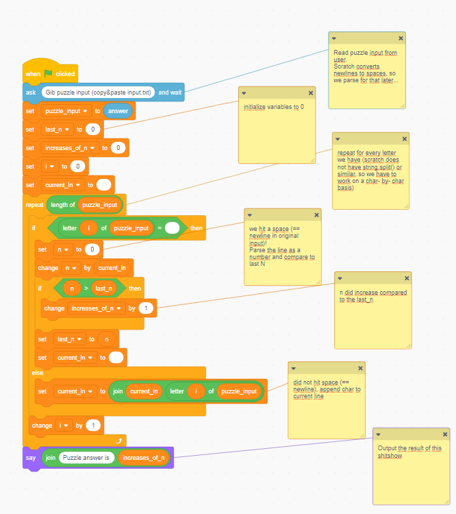
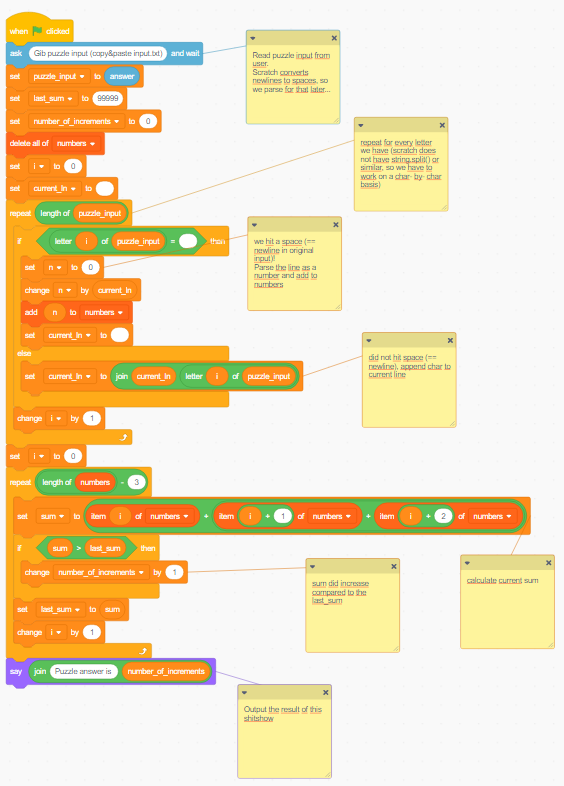

# Day 1: Scratch

For day one, i wanted to start from scratch - with [scratch](https://scratch.mit.edu/).  
In case you don't know, scratch is a programming language for kids (nothing against scratch, it literally says so on their website).  
As such, it is pretty easy to learn and use for a beginner, but also kinda limited in what you can actually do.

## Running the solutions

To run the solutions, create a new project on [scratch](https://scratch.mit.edu/) and load the solution using File>Load from your computer.  
When you run the solution, Arnold\* will ask you for the puzzle input.  
Just copy the puzzle input and paste it into the answer box (line breaks should be replaced with spaces automatically).  
After a moment, Arnold\* will tell you the puzzle answer.

_\* the scratch cat's name according to a [quick google search](https://www.google.com/search?q=scratch+mascot+name)_

## Screenshots

In case importing does not work, you can replicate the solutions using these screenshots.

Puzzle 1:

 

Puzzle 2: 

